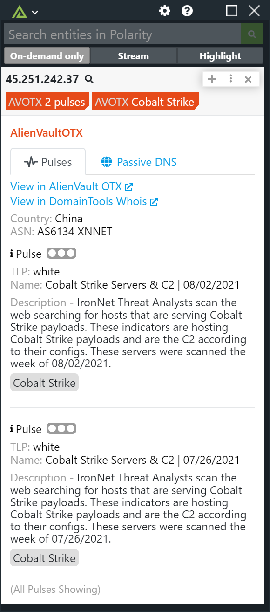
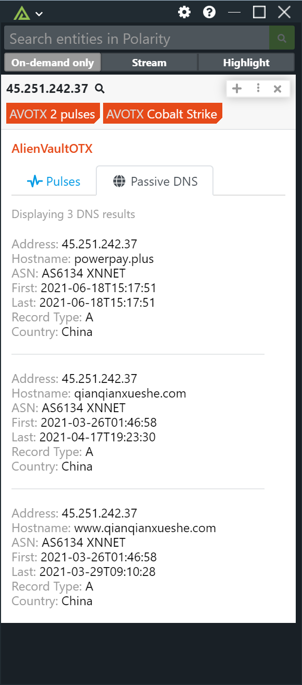

# Polarity AlienVault OTX Integration

The Polarity AlienVault OTX integration allows Polarity to search AlienVault OTX's open source API to return pulse and passive DNS information on Hashes, IPs and Domains.

> For more information on AlienVault OTX please see https://otx.alienvault.com

|  |  |
|---|--|
|*Pulse Information* | *Passive DNS Information* |

## AlienVault OTX Integration Options

### API Key

In order to use the AlienVault OTX API, you must have a valid API key. To obtain a valid API key, just sign up on AlienVault OTX's website. In your account settings you will be able to get

https://otx.alienvault.com

### Ignore Domain List

This is an alternate option that can be used to specify domains that you do not want sent to AlienVault OTX. The data must specify the entire domain to be blocked (e.g., www.google.com is treated differently than google.com). A comma delimited list can be provided.

### Ignore Domain Regex

Domains that match the given regex will not be searched 

### Ignore IP Regex

IP addresses matching the provided regex will not be searched

### Hide Results without Pulses
If checked, the integration will not display a result if there are no related Pulses

### Max Concurrent Search Requests

Maximum number of concurrent search requests (defaults to 10). Integration must be restarted after changing this option.

### Minimum Time Between Searches

Minimum amount of time in milliseconds between each entity search (defaults to 25). Integration must be restarted after changing this option.

## Installation Instructions

Installation instructions for integrations are provided on the [PolarityIO GitHub Page](https://polarityio.github.io/).

## Polarity

Polarity is a memory-augmentation platform that improves and accelerates analyst decision making.  For more information about the Polarity platform please see:

https://polarity.io/
